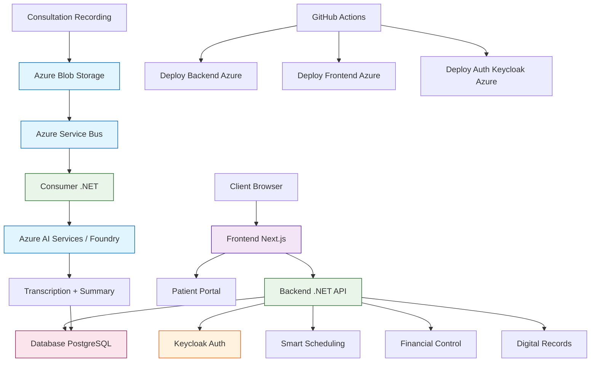

# Clinvya

English version.

[Ver em português](../)

Clinvya transforms consultations into clinical documentation automatically using AI — significantly reducing clinical bureaucracy, potentially up to 1h/day of manual work per professional. **Keywords: clinical management SaaS, AI in healthcare, digital records, medical scheduling, clinical financial control.**

### AI as Product Core

Clinvya doesn't use AI as a feature — AI is central to the clinical workflow.

- Conversation → Automatic transcription
- Transcription → Clinical structure (anamnesis/evolution)
- Structure → Ready-to-use medical record

Result: less typing, more time with the patient.

## The Problem

Health professionals still spend a large part of their time on bureaucracy:
- Manual filling of medical records
- Clinical evolution recording
- Organization of scattered information

This reduces available time for the patient and impacts care quality.

Clinvya was born to solve exactly this problem.

## How It Works in Practice

1. Professional starts recording the consultation
2. Audio is stored and sent for processing
3. AI performs automatic transcription
4. System structures data in clinical format
5. Result is saved in the patient's medical record

All this happens asynchronously and transparently for the user.

## Product Status

- Functional MVP in production
- Complete pipeline of recording → transcription → clinical structure
- Scalable event-based architecture
- Cloud infrastructure with autoscaling (Azure)

Developed in approximately 3 months, with a focus on rapid validation without compromising technical quality.

## Roadmap

- Google Calendar integration
- Health plan integrations (Open Health)
- AI engine evolution for assisted clinical suggestions
- Reminders with confirmation CTA
- Daily patient check-in
- Expansion to multi-clinics and networks
- Automatic NF-e (Brazilian invoice)
- Digital signature for documents
- Financial reports in PDF/Excel
- Holiday integration in calendar

Clinvya is in continuous evolution with a focus on becoming a complete intelligent clinical management platform.

## Project Philosophy

Clinvya was built based on three pillars:

- AI as core, not as accessory
- Scalable architecture from the start
- Execution speed with quality (SDD + AI)

The goal is to prove that it's possible to build robust and intelligent products in short cycles using modern engineering.

More than a management system, Clinvya is a practical experiment on how AI and modern engineering can redefine SaaS products.

## What It Is

- SaaS system for health clinics
- Patient management, schedules, professionals, and transactions
- Structure prepared for corporate authentication and access control
- Focus on reliability and technical governance for development teams

## Main Features

- **Smart Scheduling**: Recurring appointments, confirmations, and rescheduling in a single flow
- **Financial Control**: Transactions, payments, history, and financial performance view in one dashboard
- **Digital Records**: Complete patient history with organized clinical records
- **Integrated AI**: AI integrates recording, transcription, summaries, and helps with anamnesis and clinical progress documentation
- **Automatic Reminders**: Reduce no-shows with WhatsApp (Meta), SMS (Twilio), and email (Resend)
- **Patient 360 Panel**: Complete integrated view (progress, appointments, financial) for holistic engagement
- **Scientific Questionnaires**: Score tracking with scientifically validated questionnaires, answered directly by the patient

## Integrated AI

Clinvya incorporates artificial intelligence to optimize clinical workflow:

- **Automatic Transcription**: Real-time recording and transcription of consultations
- **Smart Summaries**: Automatic generation of session summaries
- **Documentation Assistance**: Support in writing anamnesis and clinical evolution
- **Usage Example**: During a consultation, AI transcribes the conversation between patient and professional, facilitating accurate documentation and reducing bureaucracy time

## Benefits

- **Time Savings**: AI for evolution can significantly reduce clinical bureaucracy time (potentially up to 1h/day depending on clinical flow)
- **Patient Engagement**: Dedicated portal changes how patients engage with treatment
- **Complete Financial Control**: Integrated view of transactions, payments, and performance
- **Intuitive System**: Excellent support and user-friendly interface for health professionals

## Who It's For

Ideal for health clinics seeking to modernize processes with advanced technology, including doctors, osteopaths, physiotherapists, and other health professionals who want to optimize care and reduce administrative tasks.

## Comparison with Competitors

| Feature | Clinvya | LifeUp | iClinic |
|---------|---------|--------|---------|
| **Smart Scheduling** | ✅ Recurring appointments, automatic confirmations | ✅ Basic | ✅ Advanced with reminders |
| **Financial Control** | ✅ Integrated dashboard with transactions and performance | ✅ Basic reports | ✅ Complete management |
| **Digital Records** | ✅ Complete history with organization | ✅ Standard | ✅ Customizable |
| **Integrated AI** | ✅ Automatic transcription, summaries, and documentation assistance | ❌ No | ❌ No |
| **Automatic Reminders** | ✅ WhatsApp and email | ✅ Email | ✅ Multiple channels |
| **Patient 360 Panel** | ✅ Complete integrated view (progress, appointments, financial) | ❌ Limited | ✅ Basic |
| **Scientific Questionnaires** | ✅ Validated scores for patient tracking | ❌ No | ❌ No |
| **Cloud Scalability** | ✅ Azure with auto-scaling | ✅ Limited | ✅ Moderate |
| **Health Focus** | ✅ General clinics with specialized AI | ✅ Physiotherapy | ✅ General clinics |
| **Price** | Competitive SaaS | Medium | High |

**Clinvya Differential**: Native AI integration to reduce clinical bureaucracy by up to 1 hour/day, with robust cloud architecture, advanced technical governance, **Patient 360 Panel** for holistic view, and **scientific questionnaires** for objective score tracking.

*Comparison based on publicly available features as of now.*

## Business Model

- SaaS based on monthly subscription per professional/clinic
- Scalable for multiple specialties
- Prepared for future integrations (ex: health plans, Open Health)

## Architecture and Technologies

- **Backend**: .NET 10 with ASP.NET Core minimal APIs and feature-based architecture for scalability and maintenance
- **Frontend**: Modern Next.js for responsive web experience and interactivity
- **Authentication**: Keycloak with automatic token refresh and granular role management
- **Containerization**: Docker and Docker Compose for consistent environments
- **CI/CD**: GitHub Actions for automated build and deploy pipelines

## Software Engineering

- **Spec-Driven Development (SDD)**: each feature starts with clear specification, allowing AI use (ex: Codex) to accelerate implementation while maintaining quality
- **Context Governance**: Internal agents and skills system for quality control and consistency
- **Separation of Responsibilities**: Clear architecture between API, client, and authentication
- **Transcription Pipeline**: Automated audio processing with AI integration

## Architecture Decisions

- Event-driven architecture to decouple AI processing from clinical workflow
- Messaging use (Service Bus) to ensure resilience and scalability
- Clear separation between authentication (Keycloak) and application domain
- Container deployment for portability and cost control (MVP-friendly)

## Cloud and Infrastructure

- **Azure Blob Storage**: Secure storage of audio files and transcriptions
- **Azure Service Bus**: Asynchronous messaging for transcription processing and notifications
- **Azure AI Services / Foundry**: AI services for automatic transcription, intelligent summaries, and language models (e.g., GPT via Azure OpenAI)
- **Azure Container Apps**: Deploys for backend and consumer, with automatic scalability
- **Azure Key Vault**: Secure management of secrets and certificates (prepared for integration)
- **Cloudflare**: DNS management, domain, and security protection for web applications
- **Resend**: Email service for notifications and automated reminders
- **Twilio**: SMS API for secure communications and reminders
- **Meta (WhatsApp Business)**: Integration for WhatsApp messaging, including reminders and engagement

## CI/CD and Quality

- **Automated Pipelines**: GitHub Actions for backend, frontend, and authentication, with deploys to Azure
- **Test Coverage**: Comprehensive unit and integration tests for backend (.NET) and frontend (Vitest)
- **Tests**: Complete suite of automated tests, focused on quality and reliability
- **Technical Governance**: Clear playbooks for development, handoff, and feature validation

## Architecture

**Architecture Overview:**
- **Frontend**: Next.js hosted on Azure, responsive interface for professionals and patients
- **Backend**: .NET 10 minimal API hosted on Azure Container Apps, feature-based architecture
- **Authentication**: Keycloak for user and role management, with refresh token
- **Database**: PostgreSQL for clinical and transactional data
- **Cloud Services**: Azure Blob for audio storage, Service Bus for messaging, AI Services / Foundry for transcription
- **Consumer**: .NET service for asynchronous transcription processing
- **CI/CD**: GitHub Actions automating builds, tests, and deploys

## Interested?

For more information on implementation, demo, or partnership, contact us through the [official website](https://clinvya.com) or LinkedIn.